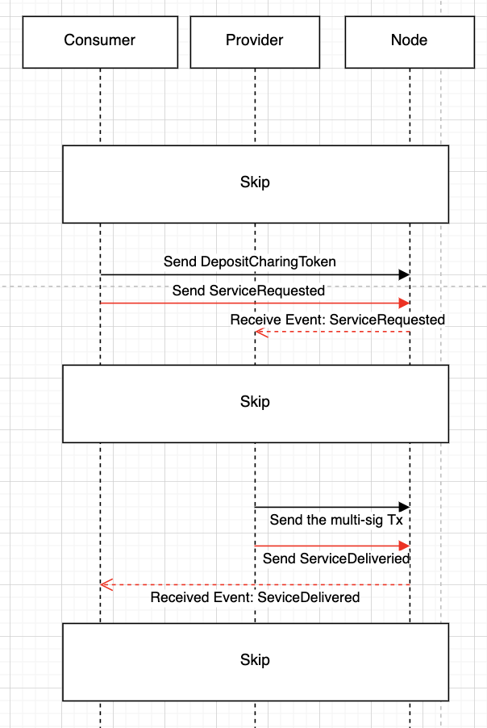

The Peaq-Transaction smart contract is a message bridge to allow the provider/consumer to get their interesting event. After receiving the event, the consumer/provider can do other actions based on the event information.

There are two scenarios here.
1. The consumer sends the extrinsic, service_requested, and the provider will check whether this event is for him. If so, the provider will use the information to check whether the balance is enough and start to charge.
2. The provider sends the service_delivered extrinsic, and when the target user gets the event, he'll do further operations, for example, approving the multi-sig transaction.

In the future, we'll add types of message bridge between the provider and consumer to our system.

